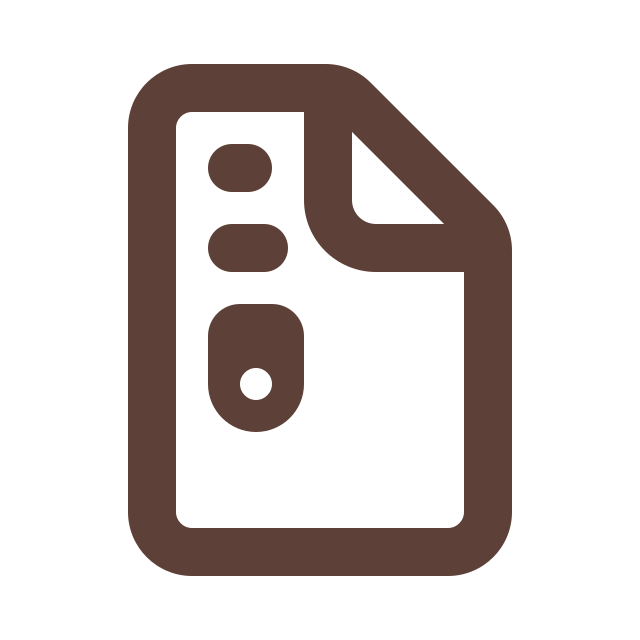
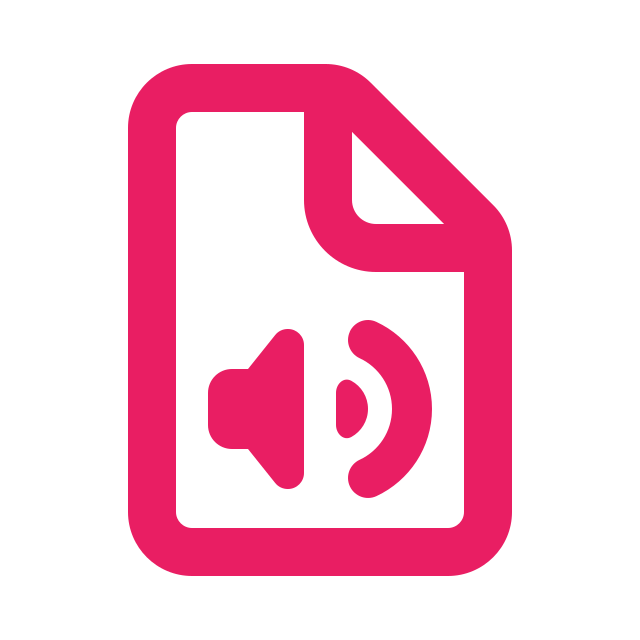

## List of available icons

This list contains all icons available in this library.

### Searching

**Tip:** Use the `Ctrl+F` (or `Cmd+F`) shortcut to quickly find the icon you need.

---

### A. Material Symbols

| Category              | Icon name          |                                                                Preview                                                                | Selector                |
| :-------------------- | :----------------- | :-----------------------------------------------------------------------------------------------------------------------------------: | :---------------------- |
| **Navigation**        | Home               |                                | `"home"`                |
| **Navigation**        | Dashboard          |                      | `"dashboard"`           |
| **Navigation**        | First Page         |                    | `"first_page"`          |
| **Navigation**        | Last Page          |                      | `"last_page"`           |
| **Navigation**        | Chevron Backward   |            | `"chevron_backward"`    |
| **Navigation**        | Chevron Forward    |            | `"chevron_forward"`     |
| **Navigation**        | Arrow Down         |  | `"keyboard_arrow_down"` |
| **Navigation**        | Arrow Up           |      | `"keyboard_arrow_up"`   |
| **Navigation**        | Close Left Panel   |        | `"left_panel_close"`    |
| **Navigation**        | Open Left Panel    |          | `"left_panel_open"`     |
| **Actions**           | Search             |                            | `"search"`              |
| **Actions**           | Edit               |                                | `"edit"`                |
| **Actions**           | Delete             |                            | `"delete"`              |
| **Actions**           | Copy               |                | `"content_copy"`        |
| **Actions**           | Cut                |                  | `"content_cut"`         |
| **Actions**           | Paste              |              | `"content_paste"`       |
| **Actions**           | Download           |                        | `"download"`            |
| **Actions**           | Upload File        |                  | `"upload_file"`         |
| **Actions**           | Send               |                                | `"send"`                |
| **Actions**           | Refresh            |                          | `"refresh"`             |
| **Actions**           | Cached             |                            | `"cached"`              |
| **Actions**           | Mop (Clean)        |                                  | `"mop"`                 |
| **Actions**           | Filter             |                    | `"filter_alt"`          |
| **Actions**           | More Horizontal    |                    | `"more_horiz"`          |
| **Actions**           | Close              |                              | `"close"`               |
| **User & Auth**       | Account Box        |                  | `"account_box"`         |
| **User & Auth**       | Account Circle     |            | `"account_circle"`      |
| **User & Auth**       | Account Circle Off |    | `"account_circle_off"`  |
| **User & Auth**       | Person Check       |                | `"person_check"`        |
| **User & Auth**       | Person Off         |                    | `"person_off"`          |
| **User & Auth**       | Groups             |                            | `"groups"`              |
| **User & Auth**       | Login              |                              | `"login"`               |
| **User & Auth**       | Logout             |                            | `"logout"`              |
| **User & Auth**       | Exit to App        |                  | `"exit_to_app"`         |
| **User & Auth**       | Lock Person        |                  | `"lock_person"`         |
| **User & Auth**       | Lock Reset         |                    | `"lock_reset"`          |
| **User & Auth**       | Lock Open          |                      | `"lock_open"`           |
| **User & Auth**       | Lock Open Right    |          | `"lock_open_right"`     |
| **User & Auth**       | User Attributes    |     | `"user_attributes"`     |
| **Files & Storage**   | Folder             |                            | `"folder"`              |
| **Files & Storage**   | Folder Eye         |                | `"folder_eye"`          |
| **Files & Storage**   | New Folder         |      | `"create_new_folder"`   |
| **Files & Storage**   | Move File          |          | `"drive_file_move"`     |
| **Files & Storage**   | Storage            |                          | `"storage"`             |
| **Files & Storage**   | Inventory          |                  | `"inventory_2"`         |
| **Files & Storage**   | Article            |                          | `"article"`             |
| **Files & Storage**   | Draft              |                              | `"draft"`               |
| **Files & Storage**   | Draft Orders       |                | `"draft_orders"`        |
| **Files & Storage**   | Photo Library      |              | `"photo_library"`       |
| **Files & Storage**   | History            |                          | `"history"`             |
| **Status & Security** | Info               |                                | `"info"`                |
| **Status & Security** | Help               |                                | `"help"`                |
| **Status & Security** | Warning            |                          | `"warning"`             |
| **Status & Security** | Check Circle       |                | `"check_circle"`        |
| **Status & Security** | Verified User      |              | `"verified_user"`       |
| **Status & Security** | Shield Question    |        | `"shield_question"`     |
| **Status & Security** | Bad Security       |                          | `"gpp_bad"`             |
| **Status & Security** | Visibility         |                    | `"visibility"`          |
| **Status & Security** | Preview            |                          | `"preview"`             |
| **Status & Security** | Label Important    |          | `"label_important"`     |
| **Status & Security** | Crown              |                       | `"crown"`               |
| **Status & Security** | Gavel              |                              | `"gavel"`               |
| **Status & Security** | Rule               |                                | `"rule"`                |
| **System**            | Settings           |                        | `"settings"`            |
| **System**            | Link               |                                | `"link"`                |
| **System**            | Open in Browser    |          | `"open_in_browser"`     |
| **System**            | Open in New        |                  | `"open_in_new"`         |
| **System**            | Event              |                              | `"event"`               |
| **System**            | Commit             |                            | `"commit"`              |

### B. Custom icons (SVG)

| Category      | Icon name         | Preview                                          | Selector              |
| :------------ | :---------------- | :----------------------------------------------- | :-------------------- |
| **File Type** | Unrecognized File |               | `"file"`              |
| **File Type** | Archive File      |       | `"file-archive"`      |
| **File Type** | Audio File        |         | `"file-audio"`        |
| **File Type** | Document File     |      | `"file-document"`     |
| **File Type** | Image File        |         | `"file-image"`        |
| **File Type** | PDF File          |           | `"file-pdf"`          |
| **File Type** | Presentation File |  | `"file-presentation"` |
| **File Type** | Spreadsheet File  |   | `"file-spreadsheet"`  |
| **File Type** | Text File         |          | `"file-text"`         |
| **File Type** | Video File        |         | `"file-video"`        |
